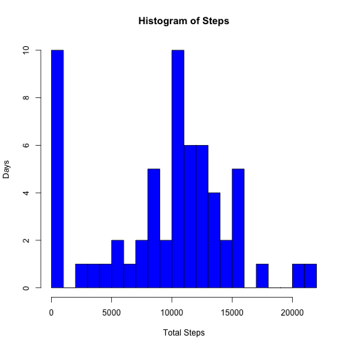
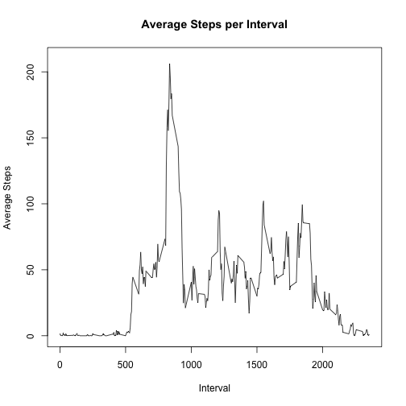
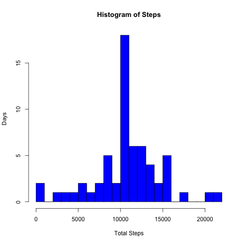
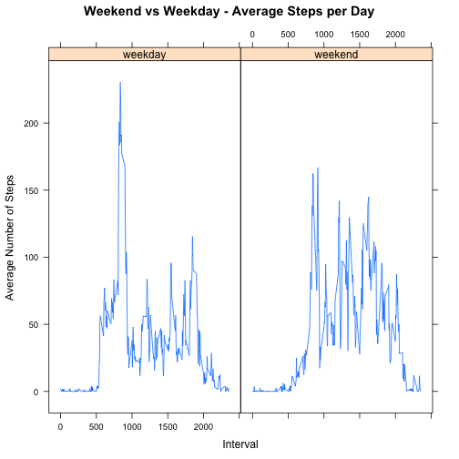

<style type="text/css">
.table {

    width: 40%;

}
</style>
###Introduction

The data analyzed in this document are activity from a personal monitoring device such as Fitbit or Jawbone. This device recorded the number of one individual's steps in 5-minute increments for two months over October and November, 2012.

```r
####Note: All bolded numbers in this document are calculated in the R code above the numbers.
####Reads the file and calculates total steps
options(scipen=999)
fileUrl <- "http://d396qusza40orc.cloudfront.net/repdata%2Fdata%2Factivity.zip"
cp2 <- download.file(fileUrl,destfile="activity.zip",method="curl",mode="wb")
dateDownloaded <- date()
unzip("activity.zip")
act <- read.csv("activity.csv")
steps <- paste(format(sum(act$steps,na.rm=TRUE),big.mark=',',format='f'))
stepday <- setNames(aggregate(act$steps, by=list(act$date), FUN=sum, na.rm=TRUE),c("Date","TotSteps"))
steps <- paste(format(steps,big.mark=',',format='f'))
```
###Steps Per Day

The total number of steps over the two month period are **570,608**. Here they are by day:


```r
####Lists the total steps per day
library("knitr")
kable(stepday,align="r")
```


|       Date| TotSteps|
|----------:|--------:|
| 2012-10-01|        0|
| 2012-10-02|      126|
| 2012-10-03|    11352|
| 2012-10-04|    12116|
| 2012-10-05|    13294|
| 2012-10-06|    15420|
| 2012-10-07|    11015|
| 2012-10-08|        0|
| 2012-10-09|    12811|
| 2012-10-10|     9900|
| 2012-10-11|    10304|
| 2012-10-12|    17382|
| 2012-10-13|    12426|
| 2012-10-14|    15098|
| 2012-10-15|    10139|
| 2012-10-16|    15084|
| 2012-10-17|    13452|
| 2012-10-18|    10056|
| 2012-10-19|    11829|
| 2012-10-20|    10395|
| 2012-10-21|     8821|
| 2012-10-22|    13460|
| 2012-10-23|     8918|
| 2012-10-24|     8355|
| 2012-10-25|     2492|
| 2012-10-26|     6778|
| 2012-10-27|    10119|
| 2012-10-28|    11458|
| 2012-10-29|     5018|
| 2012-10-30|     9819|
| 2012-10-31|    15414|
| 2012-11-01|        0|
| 2012-11-02|    10600|
| 2012-11-03|    10571|
| 2012-11-04|        0|
| 2012-11-05|    10439|
| 2012-11-06|     8334|
| 2012-11-07|    12883|
| 2012-11-08|     3219|
| 2012-11-09|        0|
| 2012-11-10|        0|
| 2012-11-11|    12608|
| 2012-11-12|    10765|
| 2012-11-13|     7336|
| 2012-11-14|        0|
| 2012-11-15|       41|
| 2012-11-16|     5441|
| 2012-11-17|    14339|
| 2012-11-18|    15110|
| 2012-11-19|     8841|
| 2012-11-20|     4472|
| 2012-11-21|    12787|
| 2012-11-22|    20427|
| 2012-11-23|    21194|
| 2012-11-24|    14478|
| 2012-11-25|    11834|
| 2012-11-26|    11162|
| 2012-11-27|    13646|
| 2012-11-28|    10183|
| 2012-11-29|     7047|
| 2012-11-30|        0|

Now see the Histogram of Steps. Notice that taking just greater than 10,000 steps per day occurred on 10 different days, and most days the individual took at least 10,000 steps. 


```r
####Creates the histogram - frequency of total steps
hist(stepday$TotSteps,col="blue",xlab="Total Steps",ylab="Days",main="Histogram of Steps",breaks=20)
```

 


```r
####Calculates mean and median both including and excluding missing values. Calculates number of missing days.
library("plyr")
mean_miss <- paste(format(round(mean(stepday$TotSteps)),big.mark=',',format='f'))
median_miss <- paste(format(median(stepday$TotSteps),big.mark=',',format='f'))
mean_no_miss <- paste(format(round(mean(stepday[stepday$TotSteps>0,"TotSteps"])),big.mark=',',format='f'))
median_no_miss <- paste(format(median(stepday[stepday$TotSteps>0,"TotSteps"]),big.mark=',',format='f'))
num_miss_days <- count(stepday,"stepday$TotStep")[1,2]
tot_days <- nrow(stepday)
```


There are **8** days of the **61** total days with missing values. If the missing days are included in the calculation, the mean and the median are **9,354** and **10,395** respectively. However including the missing days may introduce some unwanted bias in the calculations. The mean and the median steps excluding the missing days are **10,766** and **10,765** respectively.

###Average Daily Pattern

Below is a plot of the average steps per interval:

```r
####Calculates average and maximum average number of steps per interval.
avg_intv <- setNames(aggregate(act$steps, by=list(act$interval), FUN=mean, na.rm=TRUE),c("Interval","AvgSteps"))
plot(x=avg_intv$Interval,y=avg_intv$AvgSteps,type="l",xlim=c(0,2355),ylim=c(0,210),xlab="Interval",ylab="Average Steps",main="Average Steps per Interval")
```

 

```r
mx_avg_step_int <- round(max(avg_intv$AvgSteps))
avg_int_max <- avg_intv[which.max(avg_intv$AvgSteps),1]
```

The above plot shows that the maximum average number of steps in one interval is **206** and that is at interval **835**, which is between 8:35 and 8:40 AM.


```r
####Counts missing values and percent of missing values.
miss_values <- sum(is.na(act$steps))
miss_values_prt <- paste(format(sum(is.na(act$steps)),big.mark=',',format='f'))
tot_rows <- nrow(act)
tot_rows_prt <- paste(format(nrow(act),big.mark=',',format='f'))
pct_miss <- round(miss_values/tot_rows * 100)
```
###Imputing Missing Values

The total number of missing values in the original dataset is **2,304** out of **17,568** total observations, which is **13** percent. Because missing values can distort the results, they have been imputed using the mean from each 5-minute interval.

The histogram below is shown after missing values have been imputed. Notice that the number of days with under 1000 steps has now been significantly reduced when compared with the earlier histogram.


```r
####Imputes missing values by using average per 5-minute interval. Plots histogram using imputed values.
filled <- merge(act,avg_intv,by.x="interval",by.y="Interval")
filled <- within(filled, steps <- ifelse(is.na(steps), AvgSteps, steps)) ##replaces NAs
stepday2 <- setNames(aggregate(filled$steps, by=list(filled$date), FUN=sum, na.rm=TRUE),c("Date","TotSteps"))
hist(stepday2$TotSteps,col="blue",xlab="Total Steps",ylab="Days",main="Histogram of Steps",breaks=20)
```

 

```r
mean_imp_miss <- paste(format(round(mean(stepday2[stepday2$TotSteps>0,"TotSteps"])),big.mark=',',format='f'))
median_imp_miss <- paste(format(round(median(stepday2[stepday2$TotSteps>0,"TotSteps"])),big.mark=',',format='f'))
```

The mean and the median steps after imputing missing values **10,766** and **10,766** respectively. These are the same as those above when the missing values were excluded (given small variance due to rounding), but are higher than the values calculated earlier when the missing values were included.

###Weekdays versus Weekends


```r
####Creates a new Day_Type variable and uses that in a lattice plot to distinguish between activity on weekdays versus weekends. Also calculated percentages.
filled$date <- as.Date(filled$date)
wkdy <- c('Monday', 'Tuesday', 'Wednesday', 'Thursday', 'Friday')
filled$Day_Type <- c('weekend', 'weekday')[(weekdays(filled$date) %in% wkdy)+1L]
avg_intv_filled <- setNames(aggregate(filled$steps, by=list(filled$Day_Type,filled$interval), FUN=mean, na.rm=TRUE),c("Day_Type","Interval","AvgSteps"))
library("lattice")
xyplot(AvgSteps ~ Interval | Day_Type, data=avg_intv_filled, type = "l",main="Weekend vs Weekday - Average Steps per Day",ylab="Average Number of Steps")
```

 

```r
tot_intv_filled <- setNames(aggregate(filled$steps, by=list(filled$Day_Type), FUN=sum, na.rm=TRUE),c("Day_Type","TotSteps"))
wkdy_tot <- tot_intv_filled[1,2]
wkend_tot <- tot_intv_filled[2,2]
pct_wkdy <- round(wkdy_tot/(wkdy_tot+wkend_tot)*100)
pct_wkend <- round(wkend_tot/(wkdy_tot+wkend_tot)*100)
pct_wkday <- pct_wkdy/5
pct_wknd <- pct_wkend/2
```

Comparing weekend and weekday steps, **70** percent of the activity occurred on the weekdays, which is **14** percent per day, and **30** percent occurred on the weekend, which is **15** percent per day. The main difference, as shown in the two plots above is that most of the weekday activity occurred between 5 am and 10 am, and the weekend activity was fairly consistent throughout the day with the majority of the activity occuring from 5 am to 9 pm.

###Conclusion

```r
####Calculates counts and percentages over 10,000 steps.
tot_intv_filled_date <- setNames(aggregate(filled$steps, by=list(filled$date,filled$Day_Type), FUN=sum, na.rm=TRUE),c("Date","Day_Type","TotSteps"))
ov10000 <- sum(tot_intv_filled_date$TotSteps >= 10000)
pct_days <- round(ov10000/tot_days*100)
ov10000_miss <- sum(stepday$TotSteps >= 10000)
pct_days_miss <- round(ov10000_miss/tot_days*100)
```

It appears that the individual was very active for the majority of the two months. Many experts suggest walking at least 10,000 per day, and this individual accomplished this **72** percent of the time. While this person took consistent strides throughout the day, the most significant effort was between 5 and 10 AM weekday mornings. Note: However, what if the missing values were in fact days that the individual missed walking altogether? In that case, the results are less favorable, and the individual only met this goal **59** percent of the time.
